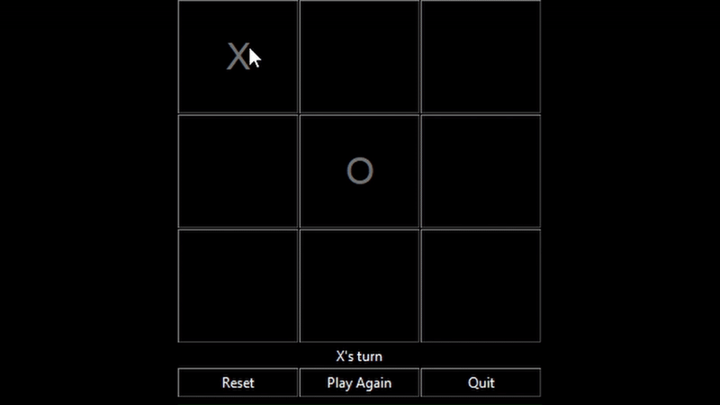

## Demo

## Features

- Unbeatable AI using Minimax algorithm (from CS50 assignment)
- Simple GUI for easy play
- Two-player support
- Python-only, no external libraries beyond `tkinter` (built-in)

## About the AI

The AI uses the **Minimax algorithm**, making it impossible to beat. This implementation was originally developed as part of an assignment for **CS50**, focusing on tradition AI algorithms.

## UI Layer

The user interface was built using Python’s built-in `tkinter` module, making it portable and easy to run. The UI was added after the course to make the game interactive and user-friendly.

